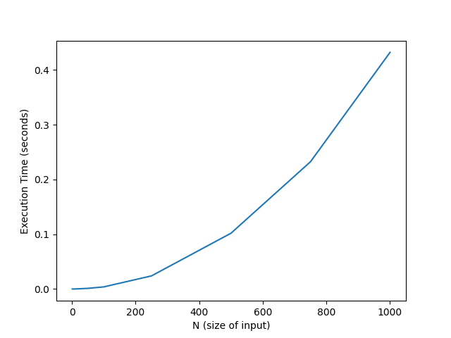
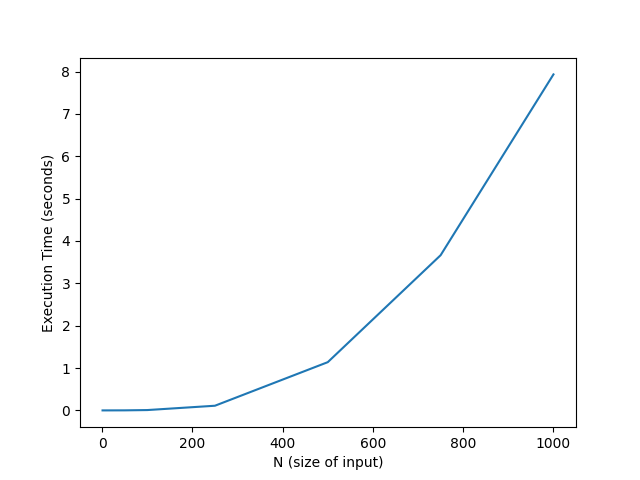

# Programming Assignment 1 (Matching and Verifying)

## Authors

- Goran Not, UFID: 71994424
- Jack Lohse, UFID: 70686167

## Files

- 'test.py' => Entry point, calls verifier or matcher and generate the plots
- 'util.py' => Parses and converts input file into desired format to be passed into G-S algorithm
- 'src/matching/algorithm.py' => Contains the implementation of G-S algorithm
- 'src/verify/verifier.py' => Performs Validity + Stability checks
- 'src/graph/grapher.py' => Utiliy functions for graphing with matplotlib

## Requirements/Dependencies

- Minimum Python >= 3.12 ('dict[int,int]' type hints used)
- Python package manager uv
- Matplotlib

## How to run

Clone the repo with:

```bash
git clone git@github.com:jackplo/PA-1.git
```

This project utilizes UV to make project management and package installation easier. This project can still be run without using uv, but it is highly recommended to use uv as it makes the process much easier. We outline the procedure for both methods below.

**If using uv:**

Install the python uv package manager if you do not have it. Below are the commands for mac, window, and linux. Alternatively visit the [uv repo](https://github.com/astral-sh/uv) for more information:

```bash
# On macOS and Linux.
curl -LsSf https://astral.sh/uv/install.sh | sh

# On Windows.
powershell -ExecutionPolicy ByPass -c "irm https://astral.sh/uv/install.ps1 | iex"
```

After installing uv, create a new virtual environment from the project root using:

```bash
uv venv
```

Then install the packages from the `pyproject.toml`

```bash
uv pip install -r pyproject.toml
```

Then run the project with the following commands:

```bash
# To run gale shapley on a single preference list
uv run test.py --gs prefs/<file>.txt

# To run gale shapley on a suite of preference list
uv run test.py --gs-suite prefs/

# To run the verifier on a single match list
uv run test.py --verify prefs/<file>.txt matches/<file>.txt

# To run the verifier on a suite of match lists (this command assumes there is a corresponding preference list for each match list)
uv run test.py --verify-suite prefs/ matches/
```

**If using pip:**

Install matplotlib with pip

```bash
python -m pip install -U pip
python -m pip install -U matplotlib
```

Make sure you are using the correct interpreter that matplotlib installed to. Then run the following commands to run the project.

```bash
# To run gale shapley on a single preference list
python test.py --gs prefs/<file>.txt

# To run gale shapley on a suite of preference list
python test.py --gs-suite prefs/

# To run the verifier on a single match list
python test.py --verify prefs/<file>.txt matches/<file>.txt

# To run the verifier on a suite of match lists (this command assumes there is a corresponding preference list for each match list)
python test.py --verify-suite prefs/ matches/
```

The above commands may differ for some people based on devices or python version. Command alternative to `python` are `python3` and `py`

## Required Input File Format

- First line: integer 'n'
- Next 'n' lines: Hospital preference lists
- Next 'n' lines: Student preference lists

## Output File Format

- Writes each matching to a file in the matches/ directory that has a name corresponding to the preference list it was generated from
- Output 'n' lines, one per hospital 'i'
- i j , meaning hospital i is matched to student j
- The verifier prints whether matching is valid and stable, or reason for invalidity/blocking pair causing unstable matching.

## Task C Solution and Graph

Gale Shapley Algorithm input size vs execution time graph


Verifier Algorithm input size vs execution time graph

